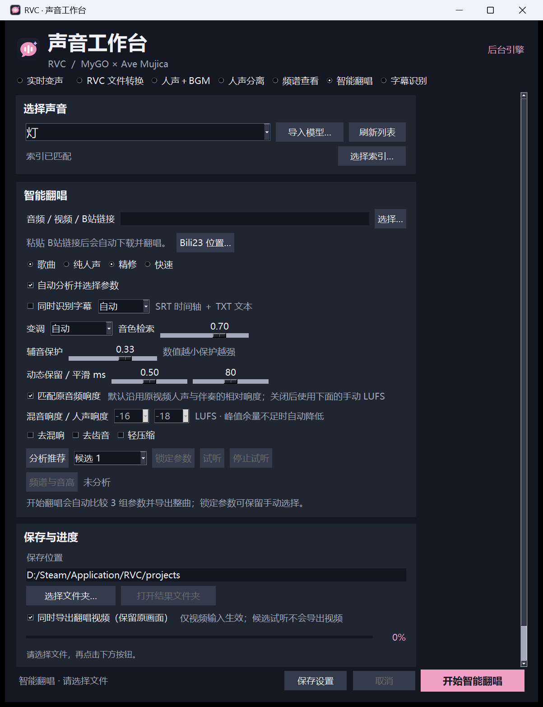

# 声音工作台（RVC Studio）

基于 RVC 的 Windows 桌面声音工作台，当前源码版本为 **1.2.7**。它把实时变声、RVC 文件转换、智能翻唱、音频分离、混音、频谱查看和字幕导出放在同一个界面中。公开源码：[soranatsu/RVC-Studio](https://github.com/soranatsu/RVC-Studio)。

视频输入默认同时输出 WAV 与翻唱视频，保留原画面并完全替换原音轨，不叠加原唱。视频放在单次结果的“主成品”中，文件名包含模型名称；画面直接复制，通常输出 MP4，容器不兼容的画面编码输出 MKV。音频短于画面时补静音，长于画面时裁齐；音轨、帧数、时长和有限值通过检查后才发布成果。可取消勾选“同时导出翻唱视频（保留原画面）”仅导出音频。

这份仓库是源码和运行说明，不是包含全部模型与运行时的完整安装包。角色音色模型、用户歌曲、索引文件、Python/CUDA 运行时和本机配置不会随源码发布。

**完整安装包：[GitHub Releases 下载](https://github.com/soranatsu/RVC-Studio/releases/latest)。** 下载 `RVC-Studio-1.2.7-Setup.exe` 和全部 4 个 `Setup-*.bin`，放在同一文件夹中运行 `.exe`，无需合并或解压数据分卷。约 6.85 GB 的安装包包含运行环境和 15 个声音模型。

约 2 MB 的 `RVC-Studio-1.2.7-Program.zip` 也继续提供，包含程序与源码，供已有对应运行环境和模型的用户使用。GitHub 自动生成的 `Source code` 压缩包仅包含源码。



## 功能

- RVC 实时变声和文件转换，支持模型、索引、变调、保护和输出设备手动设置。
- 智能翻唱：歌曲或纯人声输入，精修模式使用本机已有的 BS-Roformer，随后分析音高、响度和动态并完成 RVC、伴奏同步、混音和结果整理。
- 默认按源音频匹配翻唱人声响度；伴奏保持源响度，最后再混合。也可以关闭该选项并手动设置混音、人声和伴奏响度。
- 结果默认写入安装目录旁的 `projects/`；每次任务按“歌曲名_模型名_时间”建立独立文件夹，保存主成品、人声、伴奏、试听和报告。
- 字幕识别支持自动、中文、英语、日语和粤语，导出 UTF-8 的 SRT 时间轴和 TXT 文本，可导入剪映。自动模式按音频块检测语言，混合语言歌曲建议人工校对。
- 可粘贴 Bilibili 链接调用本机 Bili23 的官方本地 MCP 接口下载后处理；Bili23 程序、登录状态和下载目录由用户自行管理。

音质仍受输入素材、分离模型、角色模型训练音域和声学条件限制。源码中的测试覆盖任务流程、时长、峰值、错误处理和若干本机样例；这不等于所有显卡、驱动、音频设备或歌曲都已完成听感验证。

## Windows 源码运行

当前分支面向 **Python 3.12 x64**。在仓库根目录创建环境后，按显卡选择实际存在的依赖文件：

克隆时取回固定版本的 Rubber Band 上游源码：

```powershell
git clone --recurse-submodules https://github.com/soranatsu/RVC-Studio.git
cd RVC-Studio
```

若下载的是 GitHub 自动生成的 ZIP，Rubber Band 子模块不会包含在 ZIP 中；请按 [`app/tools/pitch_shift/BUILD.md`](app/tools/pitch_shift/BUILD.md) 准备对应源 commit 后编译桥接组件。

```powershell
py -3.12 -m venv .venv
.venv\Scripts\activate
python -m pip install --upgrade pip setuptools wheel
cd app
```

| 硬件 | 安装方式 |
| --- | --- |
| CPU、AMD、Intel | `python -m pip install -r requirments_cpu_py312.txt` |
| NVIDIA RTX 50 系 | 先安装 CUDA 12.8 Torch，再安装 `requirments_cu128_py312.txt` |
| NVIDIA RTX 50 系以前 | 先安装 CUDA 11.8 Torch，再安装 `requirments_cu118_py312.txt` |

RTX 50 系以前的两阶段安装示例：

```powershell
python -m pip install torch==2.7.1+cu118 torchaudio==2.7.1+cu118 `
  --index-url https://download.pytorch.org/whl/cu118 `
  --extra-index-url https://pypi.org/simple
python -m pip install -r requirments_cu118_py312.txt
```

仓库沿用上游文件名 `requirments_*.txt`。安装前请确认版本、CUDA 后缀和两阶段顺序，不要把 RTX 50 系的 CUDA 12.8 和 RTX 4060 的 CUDA 11.8 配置混用。

## 启动

源码启动入口是（在 `app/` 目录中）：

```powershell
python studio_launcher.py
```

Windows 发布包使用随包提供的运行时：

```powershell
runtime\pythonw.exe -I studio_launcher.py
```

桌面快捷方式也指向 `runtime\pythonw.exe -I studio_launcher.py`。启动器会先显示界面，再由后台准备音频设备和模型；实时变声需要可用的输入设备、输出设备以及 VB-CABLE 等虚拟设备时，请在界面中按本机实际设备选择。

## 模型与外部工具

源码仓库不包含大体积模型。按 `app/docs/SOURCES.md` 的来源和许可证说明准备以下资源，并放到代码实际读取的目录：

```text
app/assets/hubert_base/hubert_base.pt
app/assets/rmvpe/rmvpe.pt
app/assets/uvr5_weights/HP2_all_vocals.pth       快速分离：全部人声
app/assets/uvr5_weights/HP5_only_main_vocal.pth 快速分离：主要人声
app/assets/pymss_weights/model_bs_roformer_ep_317_sdr_12.9755.ckpt
app/assets/pymss_weights/model_bs_roformer_ep_317_sdr_12.9755.yaml
app/assets/weights/                                用户自己的 .pth 角色模型
app/assets/indices/                                用户自己的 .index 索引
```

精修翻唱使用上面列出的 BS-Roformer 权重和同名 YAML；快速模式使用 `app/assets/uvr5_weights/` 下的 HP 模型。字幕识别模型目录固定为 `app/assets/asr/whisper-large-v3-turbo/`。例如，用 `huggingface_hub` 下载固定 revision（该库随 Transformers 环境安装，不需要新增安装脚本）：

```powershell
python -c "from huggingface_hub import snapshot_download; snapshot_download(repo_id='openai/whisper-large-v3-turbo', revision='41f01f3fe87f28c78e2fbf8b568835947dd65ed9', local_dir='app/assets/asr/whisper-large-v3-turbo')"
```

音频处理使用 FFmpeg 的 GPL 构建。不要直接依赖会变化的 `latest` 文件名：按照 `app/tools/media/download.json` 中的 URL 下载 ZIP 到 `TEMP/ffmpeg-8.1-gpl.zip`，核对其中记录的固定 SHA-256 后运行：

```powershell
runtime\python.exe app\packaging\prepare_media.py
Copy-Item app\tools\media\ffmpeg.exe,app\tools\media\ffprobe.exe app\ -Force
```

`prepare_media.py` 会拒绝 SHA-256 不匹配的压缩包，并记录二进制版本、校验值和滤镜检查结果；上游 `latest` 换包时，必须先更新并核对 manifest，不能把未核验的文件直接当作本项目构建。Rubber Band 桥接组件的固定源码、构建依赖、提交号和 MinGW 编译命令见 [`app/tools/pitch_shift/BUILD.md`](app/tools/pitch_shift/BUILD.md)。

本机 RTX 4060 已验证 CUDA 11.8 两阶段安装和上述启动路径；CPU、AMD/Intel 以及 RTX 50 系配置文件沿用上游，当前没有在本机硬件上完成同等验证。

## 输出和故障排查

默认输出路径为程序目录旁的 `projects/`。如果模型、索引或输出设备不可用，先查看界面中的任务阶段和报告；不要删除已有结果目录来“修复”任务。日志位于程序目录的 `logs/`。

如果后台启动时报 `NoneType has no attribute write`，请确认使用的是包含 1.2.6 及后续修复的源码或发布包；该问题来自无控制台启动时的标准输出流，而不是模型本身。当前完整包为 1.2.7，旧包不能与当前源码版本混称。

## 来源、版权和许可证

上游 RVC 的原始说明保留在 [`app/docs/README_UPSTREAM.md`](app/docs/README_UPSTREAM.md)。本项目的来源、组件许可证、模型边界和用户指定的角色模型来源见 [`app/docs/SOURCES.md`](app/docs/SOURCES.md)。

用户指定的角色模型来源为：[Bilibili BV1mqKq6PE49](https://www.bilibili.com/video/BV1mqKq6PE49/)。该链接作者和逐模型分发许可证尚未由本项目独立核实，因此仓库不上传角色模型，也不对角色形象、训练数据或用户音视频作权利声明。

请同时阅读根目录 [`LICENSE`](LICENSE)、[`MIT协议暨相关引用库协议`](MIT协议暨相关引用库协议) 以及各 vendored 组件自己的 LICENSE/NOTICE。RVC 的 MIT 许可不会自动覆盖角色模型、FFmpeg、Rubber Band、Whisper 或其他第三方资产。

内置分离源码的发行包依据、原生组件版本与许可记录见 [`app/docs/THIRD_PARTY.md`](app/docs/THIRD_PARTY.md)。

## 目录说明

- `app/studio_launcher.py`：桌面启动入口。
- `app/realtime_gui.py`：桌面界面和任务提交。
- `app/studio_backend.py`、`app/studio_engine.py`：后台任务和设备/模型协调。
- `app/smart_cover.py`：智能翻唱、分离、RVC、响度匹配和结果整理。
- `app/subtitle_transcriber.py`：字幕识别与 SRT/TXT 导出。
- `app/docs/SOURCES.md`：引用来源、版本和许可证边界。
- `app/docs/README_UPSTREAM.md`：原 RVC 上游 README 的保留副本。
